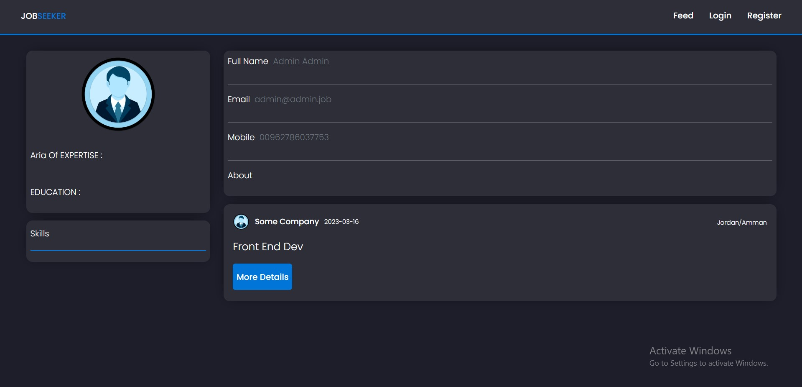

<p align="center">
<a href="https://jobseeker-73fh.onrender.com/" target="_blank" rel="noopener noreferrer">
 
 </a>
</p>

<h3 align="center">JobSeeker
</h3>

---

<p align="center"> An awesome Project to describe README 
    <br> 
<a href='https://jobseeker-73fh.onrender.com/'>Demo</a>
    <br> 
</p>

## 📝 Table of Contents

- [About](#about)
- [Getting Started](#getting_started)
- [Usage](#usage)
- [Built Using](#built_using)
- [User Story](#user_story)
- [Data Flow](#data_flow)
- [Guided By](#guided_by)

## 🧐 About <a name = "about"></a>

The Project Is About Jobs If You Looking For Specific Job Offers You Can Use Our App Or You Have A Job Offer You Can Posted On Our App .

- The Story Behind This Project Is To Help These Who Searching For A Job To Find It Faster With A Simple Steps.

## 🏁 Getting Started <a name = "getting_started"></a>

### Prerequisites

- Visual Studio Code follow this <a href='https://code.visualstudio.com/'>link</a> to install.
- Git Bash follow this <a href='https://git-scm.com/downloads'>link</a> to install.
- MongoDB follow this <a href='https://www.mongodb.com/try/download/community'>link</a> to install.
- Node.js follow this <a href='https://nodejs.org/en'>link</a> to install.

### Installing:

1. Clone the repo to your local machine using git bash.

```
git clone https://github.com/C7-mousaibrah/MERAKI_Academy_Project_4
```

2. Install packages repeat this step in backend and frontend folder

```
npm i
```

3. Then Run The App From The Main File

```
npm start
```

Now app ready to use

## 🎈 Usage <a name="usage"></a>

- You Can Navigate Throw Feed Page Without Register
  
- If You Need To Post A Job Offer You Must Sign in /Register
  

- You Can See Other Company / Users Profiles
  

- Register Page
  

- Login Page
  

## ⛏️ Built Using <a name = "built_using"></a>

- [MongoDB](https://www.mongodb.com/) - Database
- [Express JS](https://expressjs.com/) - Server Framework
- [React JS](https://https://reactjs.org/) - Web Framework
- [Node JS](https://nodejs.org/en/) - Server Environment
- [React BootStrap](https://react-bootstrap.github.io/) - Style Framework
- [Styled Component](https://styled-components.com/) - Style Framework

## User Story <a name = "#user_story"></a>

For Following This Project Story Check My
<a href='https://trello.com/b/ZMpJ5Dnw/project-4'>Trello</a> WorkSpace

## Data Flow <a name = "#data_flow"></a>

</a>

## ⚠️ Guided By <a name = "guided_by"></a>

This project is guided by ©️ **[MERAKI Academy](https://www.meraki-academy.org)**
